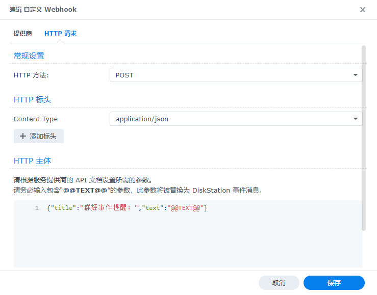
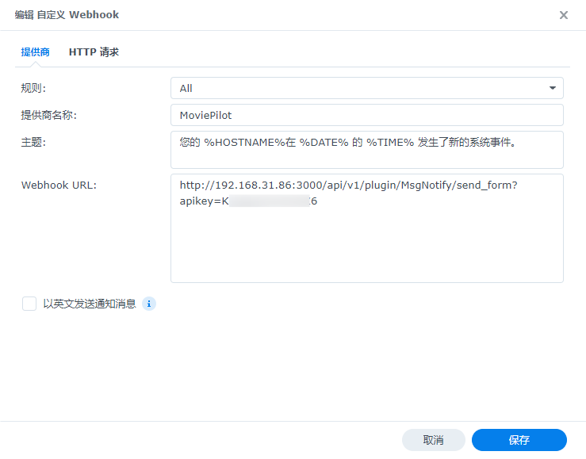
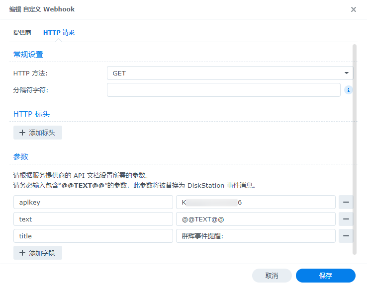
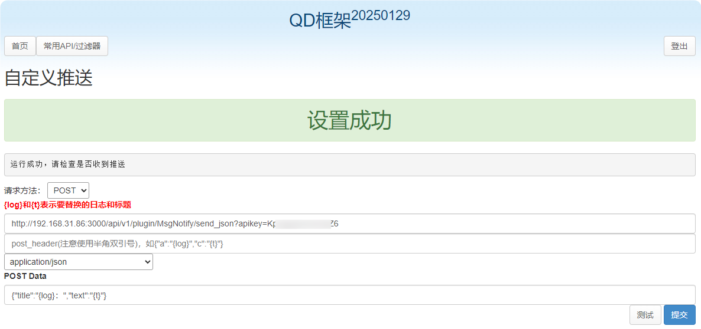
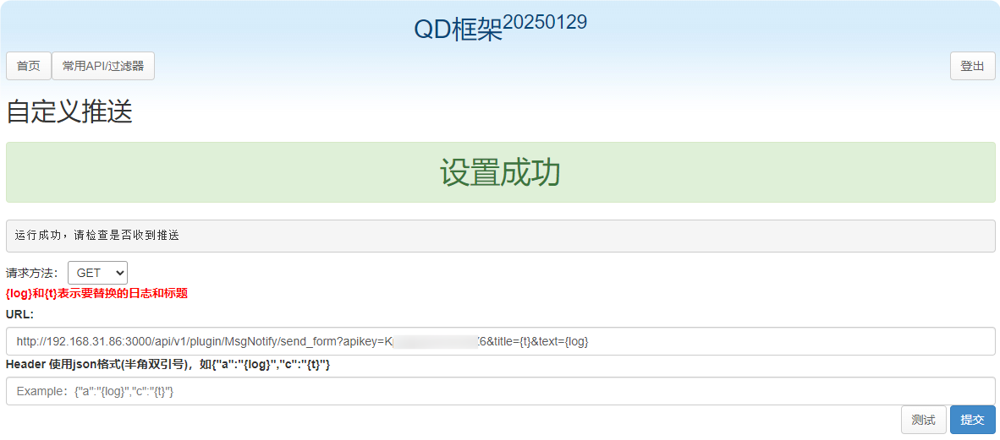
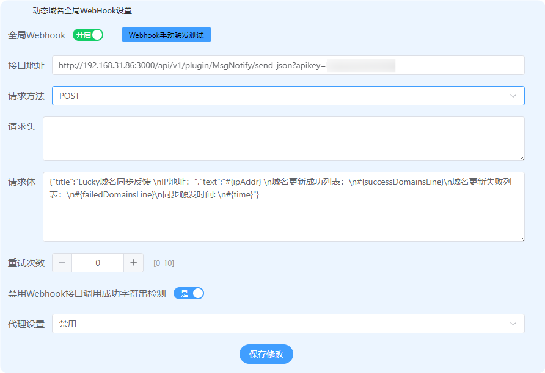
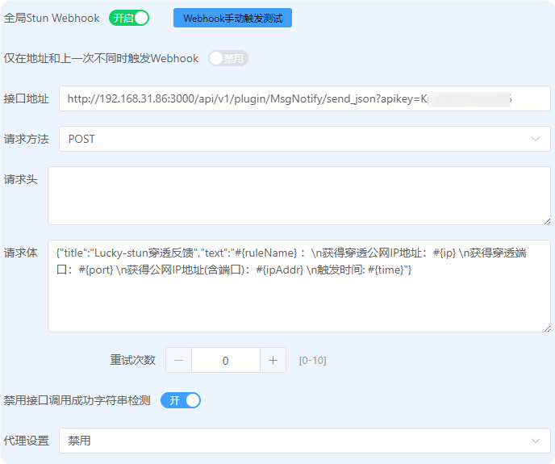
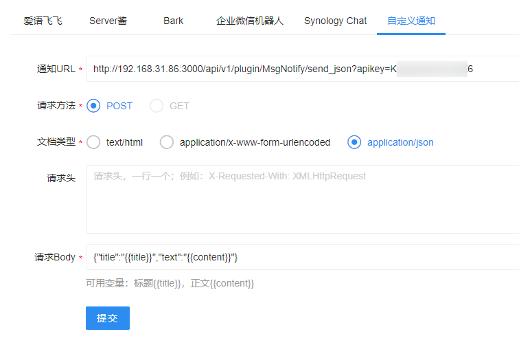
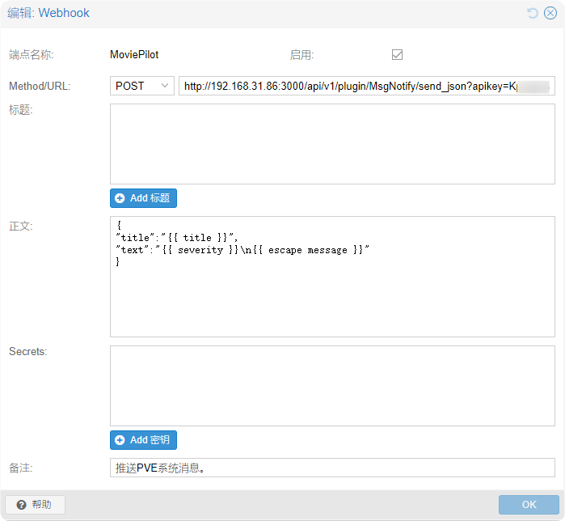

## 1. 外部消息转发使用示列
> #### 1. 群辉事件提醒
>> POST:`http://moviepilot_ip:port/api/v1/plugin/MsgNotify/send_json?apikey=api_token`
>> GET:`http://moviepilot_ip:port/api/v1/plugin/MsgNotify/send_form?apikey=api_token`
>> - HTTP主体：`{"title":"群辉事件提醒：","text":"@@TEXT@@"}`
>> - POST:
>> - 
>> - 
>> - 参数：`title`、`群辉事件提醒：`
>> - GET:
>> - 
>> - 

> #### 2. QD框架自定义消息
>> POST:`http://moviepilot_ip:port/api/v1/plugin/MsgNotify/send_json?apikey=api_token`
>> GET:`http://moviepilot_ip:port/api/v1/plugin/MsgNotify/send_form?apikey=api_token&title={log}&text={t}`
>> - POST Data：`{"title":"{log}：","text":"{t}"}`
>> - POST:
>> - 
>> - GET:
>> - 

> #### 3. Lucky 动态域名全局WebHook设置
>> POST:`http://moviepilot_ip:port/api/v1/plugin/MsgNotify/send_json?apikey=api_token`
>> - 请求体：
>> ```
>>{"title":"Lucky域名同步反馈 \nIP地址：","text":"#{ipAddr} \n域名更新成功列表：\n#{successDomainsLine}\n域名更新失败列表：\n#{failedDomainsLine}\n同步触发时间: \n#{time}"}
>>```
>> - POST:
>> - 

> #### 3.1. Lucky 全局Stun Webhook设置
>> POST:`http://moviepilot_ip:port/api/v1/plugin/MsgNotify/send_json?apikey=api_token`
>> - 请求体：
>> ```
>>{"title":"Lucky-stun穿透反馈","text":"#{ruleName} ：\n获得穿透公网IP地址：#{ip} \n获得穿透端口：#{port} \n获得公网IP地址(含端口)：#{ipAddr} \n触发时间: #{time}"}
>>```
>> - POST:
>> - 

> #### 4. IYUUPlus开发版
>> POST:`http://moviepilot_ip:port/api/v1/plugin/MsgNotify/send_json?apikey=api_token`
>> GET:`IYUUPlus暂未提供`
>> - 请求Body：`{"title":"{{title}}","text":"{{content}}"}`
>> - POST:
>> - 

> #### 5. Proxmox Virtual Environment
>>8.3.1 才有webhook： 
>>`https://you-domain/pve-docs/chapter-notifications.html#notification_targets_webhook`
>>#查询pve版本
>>`pveversion`
>>#升级到最新版本
>>`apt update && apt upgrade -y`
>>#执行完上面，这个应该可以不执行
>>`apt dist-upgrade -y`
>>#删除旧包
>>`apt autoremove`
>>#查询查询版本，自测不用重启
>>`pveversion`
>> POST:`http://moviepilot_ip:port/api/v1/plugin/MsgNotify/send_json?apikey=api_token`
>> - 正文：
>> ```
>>{
>>"title":"{{ title }}",
>>"text":"{{ severity }}\n{{ escape message }}"
>>}
>> ```
>> - POST:
>> - 
